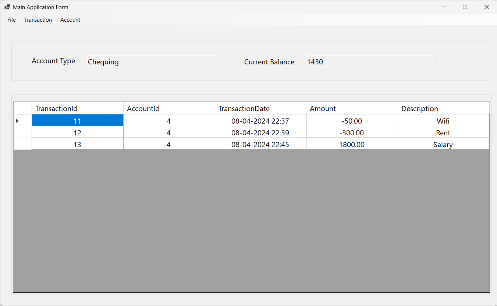
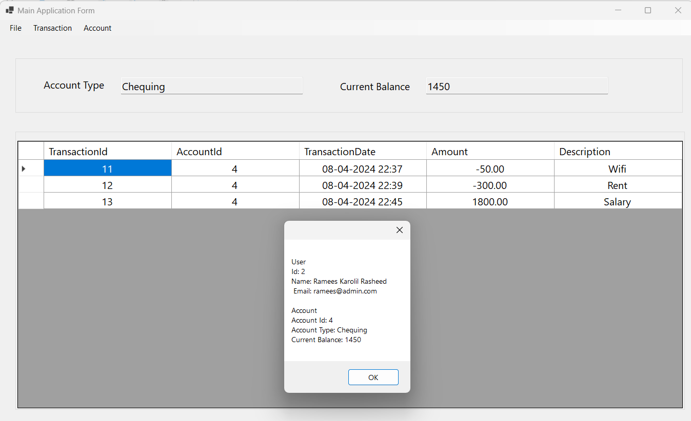
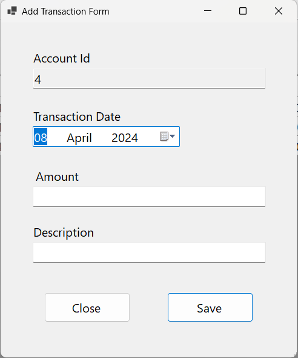
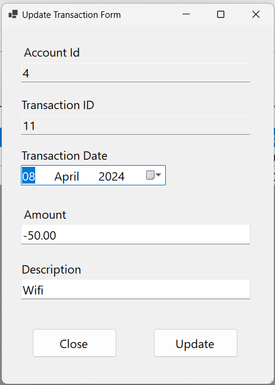
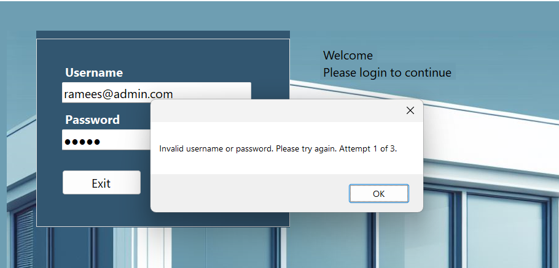

# FinanceApp

## Description

FinanceApp is a Windows Forms application designed to manage bank account transactions and provide users with access to their account details and transaction history. It allows users to view their account balances, add new transactions, update existing transactions, and delete transactions.

## Screenshots

### Login Page

### Main Application Form

### Account Summary

### Add Transaction

### Update Transaction

### Login Attempt Counter

## Features

- **Authentication:** Authenticate users to ensure secure access to account details.
- **Account Details:** View account details such as current balance and account type.
- **Transaction History:** Display transaction history with details including transaction date, amount, and description.
- **Add Transactions:** Add new transactions to the account, debiting the current balance accordingly.
- **Update Transactions:** Update existing transactions with new details.
- **Delete Transactions:** Remove transactions from the transaction history, crediting the current balance accordingly.
- **Validation:** Validate user inputs to ensure data integrity and accuracy.
- **Entity Framework Integration:** Utilize Entity Framework Core for database operations and LINQ queries.
- **User-Friendly Interface:** Designed with Windows Forms for an intuitive and user-friendly experience.

## Installation

1. Clone the repository to your local machine.
2. Ensure you have .NET 6.0 installed.
3. Open the project in Visual Studio or your preferred IDE.
4. Build and run the application.

## Usage

1. Launch the application.
2. Authenticate with your username and password.
3. Navigate through the application to view account details and transaction history.
4. Add, update, or delete transactions as needed.

## Technologies Used

- .NET 6.0
- Entity Framework Core 7.0
- Windows Forms

## License

This project is licensed under the [MIT License](LICENSE).
